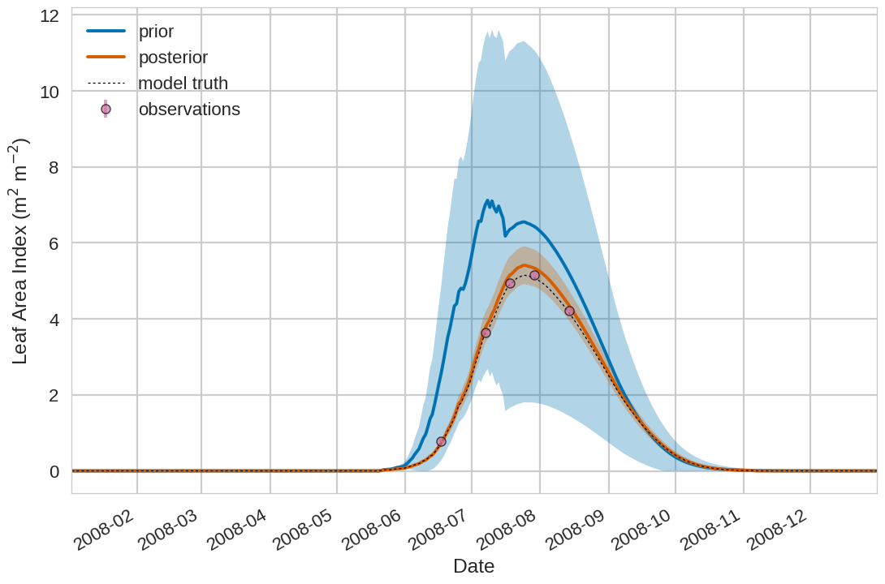
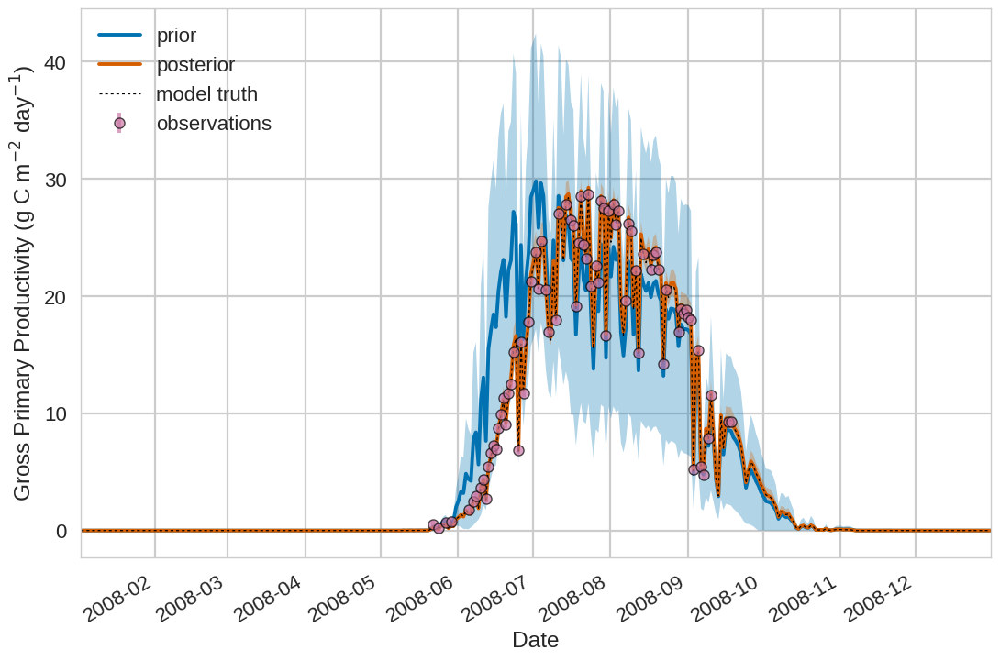
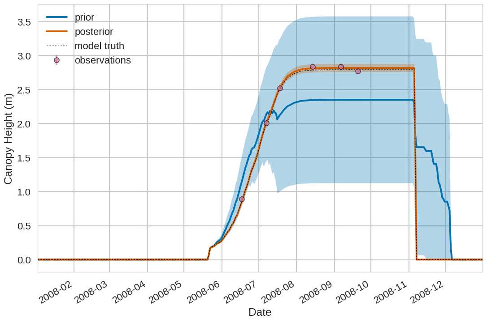
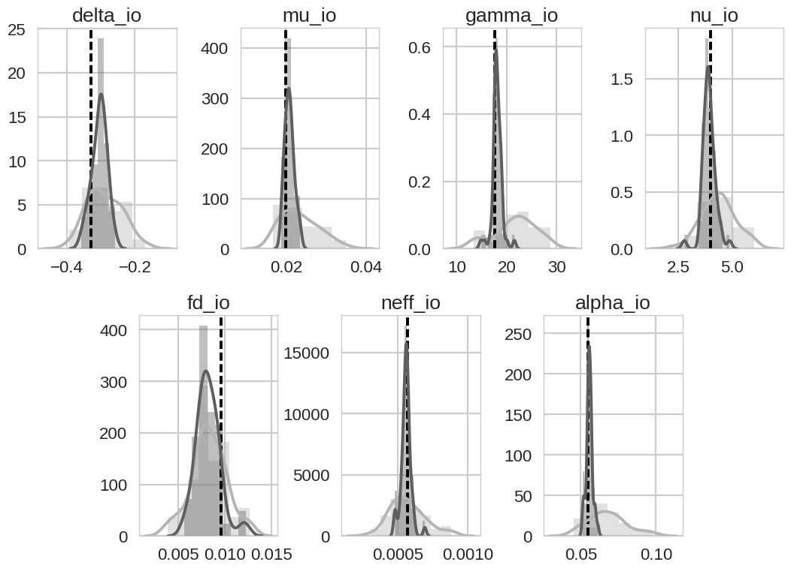

The Land Variational Ensemble Data Assimilation fRamework (LaVEnDAR)
====================================================================

The Land Variational Ensemble Data Assimilation fRamework (LaVEnDAR) implements the method of Four-Dimensional
Ensemble Variational data assimilation for land surface models. In this README we show an example of implementing
4DEnVar with the JULES land surface model.

Project overview
----------------

The data assimilation routines and minimization are included in :code:`fourdenvar.py`. For the example included in this
project you will require an installation of the JULES land surface model (more information on JULES can be found here:
https://jules.jchmr.org/ ). Model specific routines for running JULES are found in :code:`jules.py` and
:code:`run_jules.py`. The data assimilation experiment is setup in :code:`experiment_setup.py` with variables set for
output directories, model parameters, ensemble size and functions to extract observations for assimilation. The module
:code:`run_experiment.py` runs the ensemble of model runs and executes the experiment as defined by
:code:`experiment_setup.py`. Some experiment specific plotting routines are also included in :code:`plot.py`.

Data for running the JULES model can be found in the :code:`data/` directory, including driving data for the Mead maize
FLUXNET site, a JULES dump file and a JULES land fraction file. There are 2 JULES namelist file directories
:code:`example_nml` and :code:`williams_nml`. The :code:`example_nml` directory is used for JULES runs in the example
experiment included in the tutorial. The :code:`williams_nml` directory was used to produce a "model truth" JULES run
from which pseudo observations are sampled in the tutorial example. Output from the different JULES model runs are
stored in the various subdirectories under the :code:`output/` directory.

experiment_setup.py
^^^^^^^^^^^^^^^^^^^

This module controls how the experiment will be run. Output and namelist directories are set by :code:`output_directory`
and :code:`nml_directory`. The model executable path is set by :code:`model_exe`. The functions to exatract the mean
prior model estimate to the assimilated observations, the ensemble of prior estimates to the observations and the
assimilated observations are set by :code:`jules_hxb`, :code:`jules_hxb_ens` and :code:`obs_fn` respectively. These
functions are defined in the :code:`observations.py` module and are experiment and model specific.

The parameters to be optimised in the experiment are set in the dictionary :code:`opt_params`, in the tutorial
experiment the dictionary is defined as:

.. code-block:: python

    opt_params = {'pft_params': {
                      'jules_pftparm': {
                          'neff_io': [7, 6.24155040e-04, (5e-05, 0.0015)],
                          'alpha_io': [7, 6.73249126e-02, (0, 1.0)],
                          'fd_io': [7, 8.66181324e-03, (0.0001, 0.1)]}},
                  'crop_params': {
                      'jules_cropparm': {
                          'gamma_io': [2, 2.07047321e+01, (0.0, 40.0)],
                          'delta_io': [2, -2.97701647e-01, (-2.0, 0.0)],
                          'mu_io': [2, 2.37351160e-02, (0.0, 1.0)],
                          'nu_io': [2, 4.16006288e+00, (0.0, 20.0)]}}}

where each heading in the :code:`opt_params` dictionary corresponds to a JULES namelist filename and contains another
dictiontary for the JULES namelists defined within that file. Each namelist heading contains a dictionary of the
parameters to change within the namelist. The parameters hold a list of size 3 containing the index of
the parameter to be optimised, the prior value to use for the parameter and the bounds (low, high) for the parameter.
For example if we want to optimise the value of nitrogen use efficiency (:code:`neff_io`) for maize in JULES we have to
first specify the filename where this parameter appears :code:`pft_params`. Then in the dictionary below
:code:`pft_params` specify the namelist where the parameter appears :code:`jules_pftparm`. Then in the dictionary below
:code:`jules_pftparm` specify :code:`neff_io` with a list of the maize plant functional type index, its prior value and
its bounds.

We specify the error set on the prior parameters with :code:`prior_err`, the ensemble size with
:code:`ensemble_size`, the number of processors to use for the experiment with :code:`num_processes` and the seed value
for any random perturbations performed in the experiment with :code:`seed_value`. We also set a function to save
plotting output from the data assimilation experiments with :code:`save_plots` and a save directory with
:code:`plot_output_dir`.

Tutorial
--------

In this tutorial we run a twin experiment to recover 7 JULES model parameters from a known model truth.

Running data assimilation
^^^^^^^^^^^^^^^^^^^^^^^^^

We set the following variables in :code:`experiment_setup.py`

Plotting
^^^^^^^^

We have included some commands to plot output from this tutorial found in plot.py

.. image:: output/plot/harvc.png

Support
-------

In the case of any issues please contact: e.pinnington@reading.ac.uk